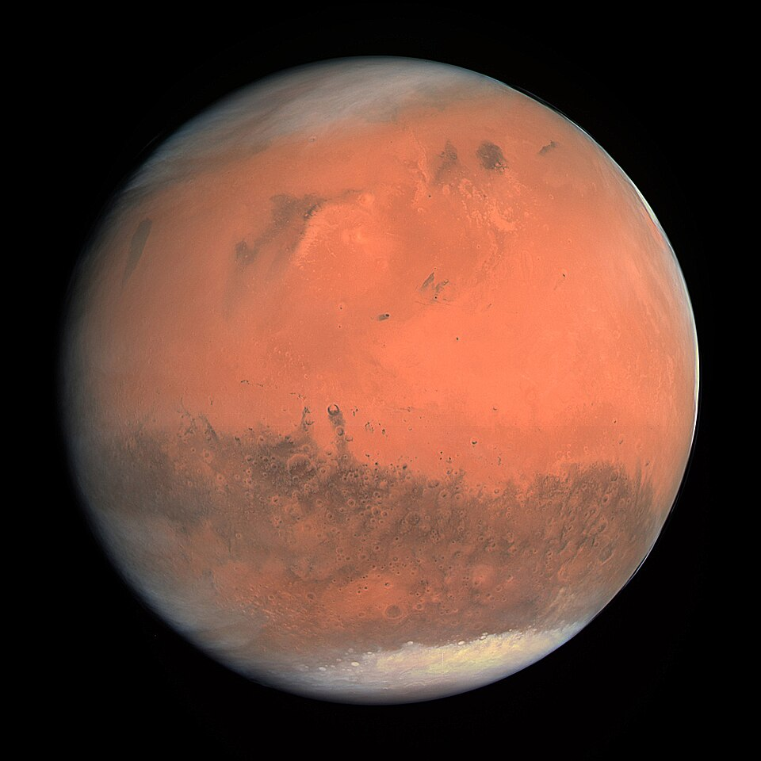

<body style="background-color: dark blue; color: white;">
</body>
<h1 style="text-align: center;">el espacio</h1>
<body bgcolor="black">

es inospito y frio. Pero tambien, es hermoso.

<html lang="es">
<head>
    <meta charset="UTF-8">
    <meta name="viewport" content="width=device-width, initial-scale=0.3">
    
<body>
    

        <h1>OSIRIS - Imagen de Marte en Color Real</h1>
        
        

            
<strong>Instrumento:</strong> OSIRIS (Optical, Spectroscopic and Infrared Remote Imaging System)

            
<strong>Satélite:</strong> ROSETTA (ESA)

            
<strong>Objetivo:</strong> Captura de Marte en color verdadero

        

    

</body>

Marte es el cuarto planeta en orden de distancia al Sol y el segundo más pequeño del sistema solar, después de Mercurio. Recibió su nombre en homenaje al homónimo dios de la guerra de la mitología romana (Ares en la mitología griega), y también es conocido como «el planeta rojo» debido a la apariencia rojiza que le confiere el óxido de hierro predominante en su superficie. Marte es el planeta interior más alejado del Sol. Es un planeta telúrico con una atmósfera delgada de dióxido de carbono, y tiene dos satélites pequeños y de forma irregular, Fobos y Deimos (hijos del dios griego), que podrían ser asteroides capturados similares al asteroide troyano (5261) Eureka. Sus características superficiales recuerdan tanto a los cráteres de la Luna como a los valles, desiertos y casquetes polares de la Tierra.

<head>
    <meta charset="UTF-8">
    <meta name="viewport" content="width=device-width, initial-scale=1.0">
</head>
<body>
    
</body>

El periodo de rotación y los ciclos estacionales son similares a los de la Tierra, ya que la inclinación es lo que genera las estaciones. Marte alberga el Monte Olimpo, la montaña y el volcán más grande y alto conocido en el sistema solar, y los Valles Marineris, uno de los mayores cañones del sistema solar. La llana cuenca Boreal en el hemisferio norte cubre el 40 % del planeta y puede ser característica de un gigantesco impacto. Aunque en apariencia podría parecer un planeta muerto, no lo es. Sus campos de dunas siguen siendo mecidos por el viento marciano, sus casquetes polares cambian con las estaciones e incluso parece que hay algunos pequeños flujos estacionales de agua.

 
